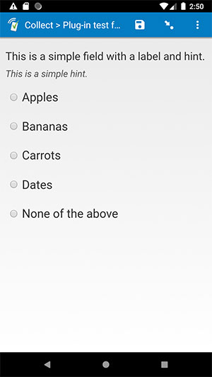
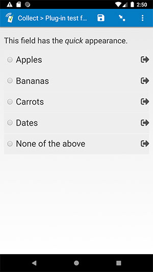

# Baseline select_one field

| likert | minimal | quick |
| --- | --- | --- |
|  |  |  |

## Description

A simple replacement for the default *select_one* field, plus a few improvements (see below). You can either download and use this as-is, or you can use it as a starting template when creating your own field plug-in for a *select_one* field.

### Features

In addition to supporting the default SurveyCTO features listed below, this field plug-in offers the following expanded functionality:

* **Support for RTL languages**  
    If your *label*, *hint*, or choice labels are in a language that uses a right-to-left alphabet (like Arabic), they will be right-justified, and the radio buttons will be to the right of the choice labels. If your form contains both right-to-left and left-to-right choice labels, the formatting will respond to the currently-selected form language.
* **Support for HTML in choice labels**  
    This plug-in will allow HTML in choice labels to be rendered as HTML, even in Collect on Android and iOS.
* **Support for HTML in field references**  
    If you reference another field's value in either the field *label* or field *hint*, and that referenced value contains HTML, the HTML will be correctly rendered.

### Data format

This field plug-in requires the `select_one` field type.

## How to use

### Getting started

**To use this plug-in as-is**, just download the [baseline-select_one.fieldplugin.zip](https://github.com/surveycto/baseline-select_one/raw/master/baseline-select_one.fieldplugin.zip) file from this repo, specify this field plug-in as a custom field *appearance* in the form design (like in [the test form](https://github.com/surveycto/baseline-select_one/raw/master/extras/test-form/test-form-package-baseline-select_one.zip)), and attach it to your form. For more details about using field plug-ins, please read the [user documentation](https://docs.surveycto.com/02-designing-forms/03-advanced-topics/06.using-field-plug-ins.html).

**To create your own** field plug-in using this as a template, follow these steps:

1. Fork this repo
1. Make changes to the files in the `source` directory.  
    * **Note:** be sure to update the `manifest.json` file as well.
1. Zip the updated contents of the `source` directory.
1. Rename the .zip file to *yourpluginname*.fieldplugin.zip (replace *yourpluginname* with the name you want to use for your plug-in).
1. You may then attach your new .fieldplugin.zip file to your form as normal.

For more information about developing your own field plug-ins, please read the [developer documentation](https://github.com/surveycto/Field-plug-in-resources).

### Default SurveyCTO feature support

| Feature / Property | Support |
| --- | --- |
| Supported field type(s) | `select_one`|
| Default values | Yes |
| Custom constraint message | Yes |
| Custom required message | Yes |
| Read only | Yes |
| media:image | Yes |
| media:audio | Yes |
| media:video | Yes |
| `quick` appearance | Yes |
| `minimal` appearance | Yes |
| `compact` appearance | No |
| `compact-#` appearance | No |
| `quickcompact` appearance | No |
| `quickcompact-#` appearance | No |
| `likert` appearance | Yes |
| `likert-min` appearance | Yes* |
| `likert-mid` appearance | No |

**Note:** this plug-in works well for the `likert-min` *appearance* when the field label is short, and does not contain an image, audio, or video. This is a known limitation currently.

## More resources

* **Test form**  
This form will help you explore the differences between this field plug-in and the default text field.  
[Download test form package](https://github.com/surveycto/baseline-select_one/raw/master/extras/test-form/test-form-package-baseline-select_one.zip)  
[Instructions for test form](/extras/test-form/README.md)

* **Developer documentation**  
Instructions and resources for developing your own field plug-ins.  
[https://github.com/surveycto/Field-plug-in-resources](https://github.com/surveycto/Field-plug-in-resources)

* **User documentation**  
How to get started using field plug-ins in your SurveyCTO form.  
[https://docs.surveycto.com/02-designing-forms/03-advanced-topics/06.using-field-plug-ins.html](https://docs.surveycto.com/02-designing-forms/03-advanced-topics/06.using-field-plug-ins.html)
