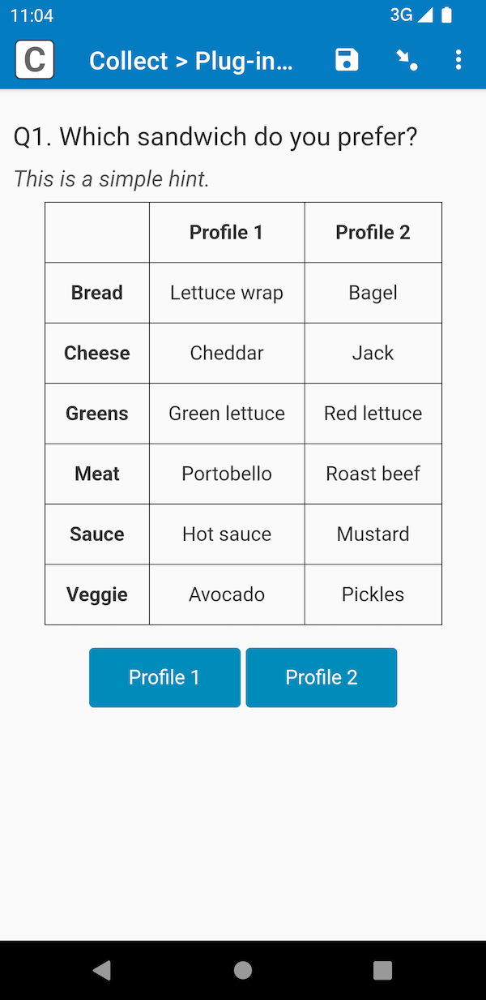

# Conjoint Analysis

## Description

This field plug-in is designed to help implement [conjoint analysis](https://en.wikipedia.org/wiki/Conjoint_analysis).

Conjoint analysis is a research technique used to understand how people make decisions based on various attributes of a product or service. It helps in determining which features are most important to consumers and how they trade off one attribute against another. This field plug-in displays a set of profile pairs, randomly combined based on attributes you provide, for respondents to select their favorite. Analyze the collected data to identify which attributes have the most influence.

### Features

* Define various features (attributes) and their different possible states or degrees (levels). (See an example [here](extras/use-case-details.md).)
* Generate profiles consisting of random combinations of attribute levels based on the defined features.
* Randomize the order in which the attributes are displayed.
* Restrict changing answer once recorded to prevent bias.

For more details see the Support Center Guide [How to conduct Conjoint Analysis in SurveyCTO](https://support.surveycto.com/hc/en-us/articles/19564034894867).

### Data format

The field stores a pipe (`|`) separated list of the ordinal representations of the options, as defined in the form. These are mapped to what is presented to the respondant and the choice selected. For example the result might be:

    1,3,6|2,3,5|3,6,1|2

The string representation of this would be:

`Bread,Roll,Lettuce wrap|Protein,Turkey,Egg|Veggie,Bean sprouts,Tomato|Profile 2`

Each item (separated by a pipe (`|`)) in the list represents a row in the table generated. So the item: 

 1,3,6 or its string representation `Bread,Roll,Lettuce wrap` represents a row in the table. This can be further broken down into:

 - `1` (Bread) - the attribute
 - `3` (Roll) - the attribute level generated for the first profile
 - `6` (Lettuce warp) - the attribute level generated for the second profile

Following this logic, it means the options were presented as follows: 

|  | Profile 1 | Profile 2 |
| --- | --- | --- |
| Bread | Roll | Lettuce wrap|
| Protein | Turkey | Egg |
| Veggie | Bean sprouts | Tomato |

And the selected option was `Profile 2`.

By default, the numeric representation is what is stored but you can also store a `string` representation of the options using the `data_format` parameter. Each field will be presented this way.

## How to use

### Getting started

1. Download the [sample form](https://github.com/surveycto/conjoint/blob/master/extras/Sample%20form%20Conjoint%20Analysis.xlsx) from this repo and upload it to your SurveyCTO server.
2. Download the [conjoint.fieldplugin.zip file](https://github.com/surveycto/conjoint/blob/master/conjoint.fieldplugin.zip) from this repo, and attach it to the test form on your SurveyCTO server.
3. Make sure to provide the correct parameters (see below).

### Parameters

| Key | Value |
| --- | --- |
| `attributes` | Comma-separated list of attributes. |
| `levels` | This consists of two parts. The full string should be a pipe-separated list, with an item for each attribute. Each item in that list should be a comma-separated list of levels for that attribute. |
| `labels` (Optional) | A comma-separated list of labels. These are used as the table headers and button labels. For now, there can only be two labels, one for each possible choice. The default labels are *Profile 1* and *Profile 2*. |
| `randomize` (Optional) | Indicates whether the attributes should be randomized or not (How would they be randomized? Shouldn't they always be randomized?). By default, attributes are not randomized, they appear in a fixed order. Set this to `1` to have the attributes randomized. |
| `bypass` (Optional) | Provides an option for users to choose none of the presented profiles by using a button. Initially, this button is hidden. However, when a value is assigned, this will trigger the display of a button labeled with the assigned value. (What does the value of this signify? Is it the value assigned to the field when it is bypassed?) |
| `data_format` (Optional) | The default behavior of the field plug-in is for the field value to store the ordinal (numeric) values of the attributes and levels. However, if you use this parameter to specify `data_format = 'string'`, then the field plug-in will store the string values instead, as supplied by the `attributes` and `levels` parameters. |

(There should be a lot more detail on the format of attributes, and levels, including how they relate to each other.)

### Examples

Here is an example *appearance* for your *text* field that uses this field plug-in: 

    `custom-conjoint(attributes = 'Bread,Protein,Veggies', levels = 'Bagel,Hero,Roll,Sliced white|Ham,Roast beef,Turkey|Tomato,Jalapenos,Roasted peppers,Onion' labels='Option 1, Option 2',bypass='None of the above')`

## More resources

* **Sample form**  
This form will help you explore the features in this field plug-in.  
[Download sample form](https://github.com/surveycto/conjoint/blob/master/extras/Sample%20form%20Conjoint%20Analysis.xlsx)  

* **Developer documentation**  
Instructions and resources for developing your own field plug-ins.  
[https://github.com/surveycto/Field-plug-in-resources](https://github.com/surveycto/Field-plug-in-resources)

* **User documentation**  
How to get started using field plug-ins in your SurveyCTO form.  
[https://docs.surveycto.com/02-designing-forms/03-advanced-topics/06.using-field-plug-ins.html](https://docs.surveycto.com/02-designing-forms/03-advanced-topics/06.using-field-plug-ins.html)
